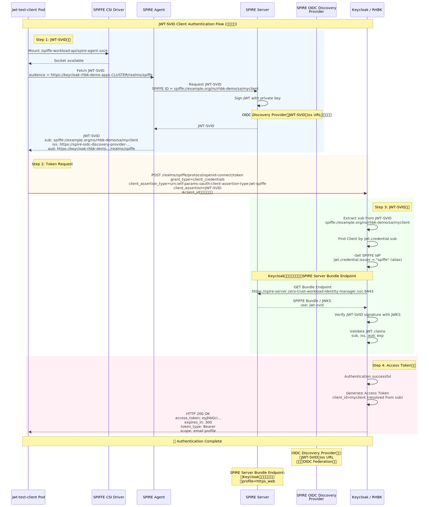

# RHBK + SPIFFE GitOps Environment

Red Hat build of Keycloak (RHBK) + OpenShift Zero Trust Workload Identity Manager (ZTWIM/SPIRE) + SPIFFE JWT-SVID認証環境のGitOps構成

## 概要

このリポジトリは、RHBK 26.6.4とSPIRE/SPIFFEを使用したJWT-SVID認証環境を、OpenShift GitOps (Argo CD)で自動構築するための構成を提供します。

**主な特徴:**
- Keycloak Client設定の完全自動化
- デフォルトClusterSPIFFEIDテンプレート使用による一貫性
- Application finalizerによるリソースクリーンアップ
- 手動設定作業を最小化（4ステップ → 2ステップ）

## アーキテクチャ

### システム構成図



### デプロイメントフロー

```
00-namespaces → 10-operators → 20-spire → 30-rhbk → 40-keycloak-config → 50-test-workloads
```

- **00-namespaces**: Namespace作成（rhbk-demo）
- **10-operators**: ZTWIM / RHBK Operator導入
- **20-spire**: SPIRE Server/Agent（デフォルトClusterSPIFFEID使用）
- **30-rhbk**: Keycloak + PostgreSQL作成
- **40-keycloak-config**: Keycloak Realm / SPIFFE IdP / Client自動設定
- **50-test-workloads**: JWT-SVID認証テスト用Pod（Deployment）

### JWT-SVID認証フロー



**主な特徴:**
- 実際の成功ログから取得した値を反映（実測値ベース）
- SPIFFE ID: `spiffe://example.org/ns/rhbk-demo/sa/myclient` (ServiceAccount形式)
- JWT-SVID `iss`: SPIRE OIDC Discovery Provider URL
- Keycloakの公開鍵取得先: SPIRE Server Bundle Endpoint（実構成）
- `client_id`は送信不要（JWT-SVIDの`sub`から自動解決）
- OIDC Discovery Providerの役割を明確化

<details>
<summary>アーカイブされた図（参考用）</summary>

ステップ別の詳細図およびv1図は以下のアーカイブから参照できます：
- v1統合図: [archive/images/auth-flow.svg](archive/images/auth-flow.svg)
- Step 1（JWT-SVID取得）: [archive/images/auth-flow-step1.svg](archive/images/auth-flow-step1.svg)
- Step 2-4（Keycloak認証）: [archive/images/auth-flow-step2-4.svg](archive/images/auth-flow-step2-4.svg)

</details>

## デプロイ

### 前提条件

- OpenShift GitOps Operator インストール済み
- GitHubリポジトリURL: `https://github.com/kamori/spiffe-rhbk.git`

### App-of-Apps デプロイ

```bash
oc apply -f clusters/dev/applications/app-of-apps.yaml
```

### クリーンアップ

```bash
oc delete application rhbk-spiffe-dev -n openshift-gitops
```

Applicationを削除すると、finalizerによって関連リソースも自動削除されます。

## ディレクトリ構成

```
spiffe-rhbk/
├── clusters/dev/applications/    # Argo CD Application定義
├── platform/
│   ├── namespaces/               # Namespace定義
│   └── operators/                # Operator Subscription/OperatorGroup
├── spire/                        # SPIRE Server/Agent CR
├── rhbk/                         # Keycloak + PostgreSQL
├── keycloak-config/              # Keycloak設定Job
├── test-workloads/               # テスト用Pod
│   ├── base/                     # jwt-test-client Deployment
│   └── docker/                   # カスタムイメージビルド
├── scripts/                      # テストスクリプト
├── docs/                         # ドキュメント
└── deprecated/                   # 廃止されたスクリプト（参考用）
```

## 検証

### デプロイ確認

全Applicationが`Synced`かつ`Healthy`であることを確認:

```bash
oc get application -n openshift-gitops
```

期待される出力:
```
NAME                 SYNC STATUS   HEALTH STATUS
00-namespaces        Synced        Healthy
10-operators         Synced        Healthy
20-spire             Synced        Healthy
30-rhbk              Synced        Healthy
40-keycloak-config   Synced        Healthy
50-test-workloads    Synced        Healthy
rhbk-spiffe-dev      Synced        Healthy
```

### SPIRE Server確認

```bash
oc get spireserver cluster -n zero-trust-workload-identity-manager
oc get pod -n zero-trust-workload-identity-manager -l app.kubernetes.io/name=spire-server
```

### Keycloak確認

```bash
oc get keycloak -n rhbk-demo
oc get pod -n rhbk-demo -l app=keycloak
```

### SPIFFE Workload API確認

```bash
POD=$(oc get pod -n rhbk-demo -l app=jwt-test-client --field-selector=status.phase=Running -o jsonpath='{.items[?(@.metadata.ownerReferences[0].kind=="ReplicaSet")].metadata.name}' | awk '{print $1}')
oc exec $POD -n rhbk-demo -c client -- ls -la /spiffe-workload-api/spire-agent.sock
```

## 構成詳細

### バージョン

- **RHBK**: 26.6.4
- **ZTWIM Operator**: stable-v1
- **SPIRE Agent**: 1.13.3-dev

### SPIRE設定

- **SpireServer profile**: `https_web`
- **Trust Domain**: `example.org`
- **CA Key Type**: `ec-p256`
- **ClusterSPIFFEID**: デフォルトテンプレート使用
  ```
  spiffe://{{ .TrustDomain }}/ns/{{ .PodMeta.Namespace }}/sa/{{ .PodSpec.ServiceAccountName }}
  ```
- **SPIRE Server Endpoint**: `https://spire-server.zero-trust-workload-identity-manager.svc.cluster.local:8443`

### Keycloak設定

- **Realm**: `spiffe`
- **Features**: `spiffe`, `client-auth-federated`
- **SPIFFE IdP alias**: `spiffe`
- **Bundle Endpoint**: `https://spire-server.zero-trust-workload-identity-manager.svc.cluster.local:8443`
- **Client ID**: `myclient`
- **Client Authenticator**: `federated-jwt`
- **Client SPIFFE ID**: `spiffe://example.org/ns/rhbk-demo/sa/myclient` (自動設定)
- **client_assertion_type**: `urn:ietf:params:oauth:client-assertion-type:jwt-spiffe`

## JWT-SVID認証テスト

完全な認証テストガイド: **[JWT-SVID Authentication Guide](docs/JWT-SVID-AUTHENTICATION-GUIDE.md)**

### クイックスタート

GitOps改善により、**手動作業を4ステップから1ステップに削減**しました。

```bash
# 認証テスト実行（spire-agentバイナリは既にカスタムイメージに組み込み済み）
./scripts/test-jwt-svid-complete.sh
```

**改善点:**
- カスタムコンテナイメージ（`quay.io/kamori/jwt-svid-test-client:v1.0`）にspire-agentバイナリを事前組み込み
- Pod再起動後も自動的に動作（手動インストール不要）
- RHEL9ベースで完全な互換性を確保

### 成功時の出力例

```
✅ SUCCESS: Keycloak authentication successful!

Response:
{
  "access_token": "eyJhbGci...",
  "expires_in": 300,
  "token_type": "Bearer",
  "scope": "email profile"
}

Summary:
  ✓ Access Token: eyJhbGci...
  ✓ Token Type: Bearer
  ✓ Expires In: 300s

  ✓ Result saved to: logs/SUCCESS-GITOPS-20260627-164556.json
```

### 自動化された設定

以下の設定が自動的に正しく構成されます：

- ✅ **Keycloak Client SPIFFE ID**: `spiffe://example.org/ns/rhbk-demo/sa/myclient`
- ✅ **Bundle Endpoint**: `https://spire-server.zero-trust-workload-identity-manager.svc.cluster.local:8443`
- ✅ **ClusterSPIFFEID**: デフォルトテンプレート使用

**従来必要だった手動作業（不要になりました）:**
- ~~Keycloak Client設定の修正~~
- ~~Keycloak Pod再起動~~

## ドキュメント

### テスト手順

- **[JWT-SVID認証テストガイド](docs/JWT-SVID-AUTHENTICATION-GUIDE.md)** - 完全な認証テスト手順

### 設計資料

- [GitOps環境構築ガイドライン](docs/design/rhbk_spiffe_gitops_environment_guidelines.md) - 環境構築の設計原則
- [GitOps改善履歴](docs/GITOPS-IMPROVEMENTS.md) - 自動化改善の詳細

### レポート

- [docs/report/](docs/report/) - 調査レポート・トラブルシューティング記録

## トラブルシューティング

### Application削除がスタックする場合

Operator管理リソース（SpireServer, SpireOIDCDiscoveryProvider等）に`foregroundDeletion` finalizerが付いている場合、子リソースの削除を待ちます。エラー状態のDeploymentがある場合は手動で削除します。

```bash
# スタック状況確認
oc get application -n openshift-gitops

# Operator管理リソース確認
oc get spireserver,spireoidcdiscoveryprovider -n zero-trust-workload-identity-manager

# 必要に応じて手動削除
oc delete deployment spire-spiffe-oidc-discovery-provider -n zero-trust-workload-identity-manager --force --grace-period=0
```

### Pod選択スクリプトエラー

JobとDeploymentが同じラベルを持つため、スクリプトがJob Podを誤選択する場合があります。スクリプトは`ownerReferences`でDeployment Podを選択するよう修正済みです。

```bash
# 正しいPod選択例
CLIENT_POD=$(oc get pod -n rhbk-demo -l app=jwt-test-client --field-selector=status.phase=Running \
  -o jsonpath='{.items[?(@.metadata.ownerReferences[0].kind=="ReplicaSet")].metadata.name}' | awk '{print $1}')
```
